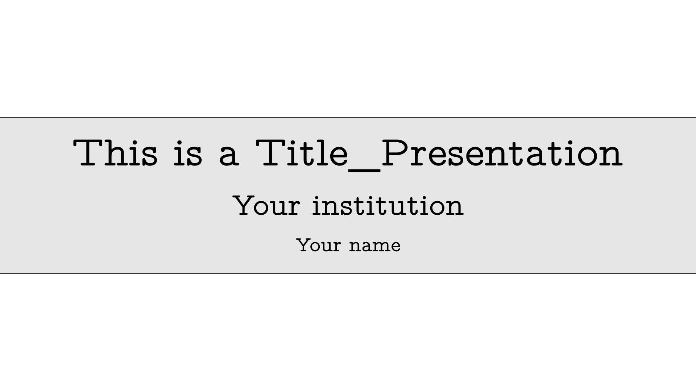
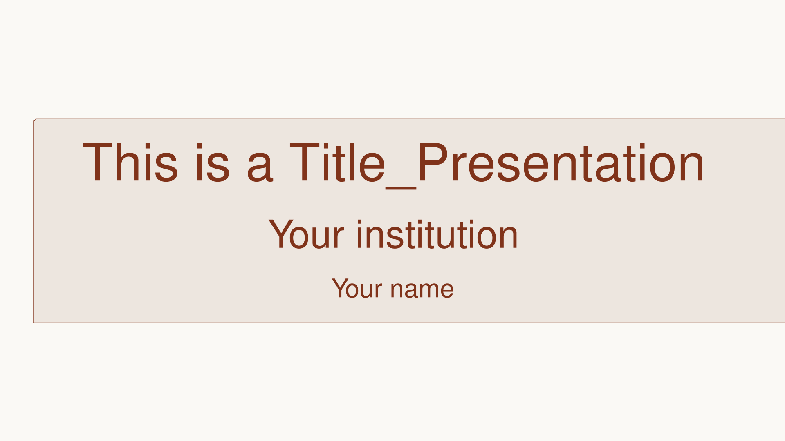
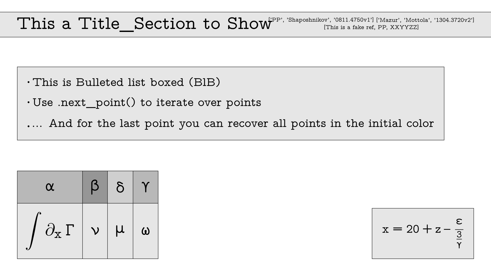
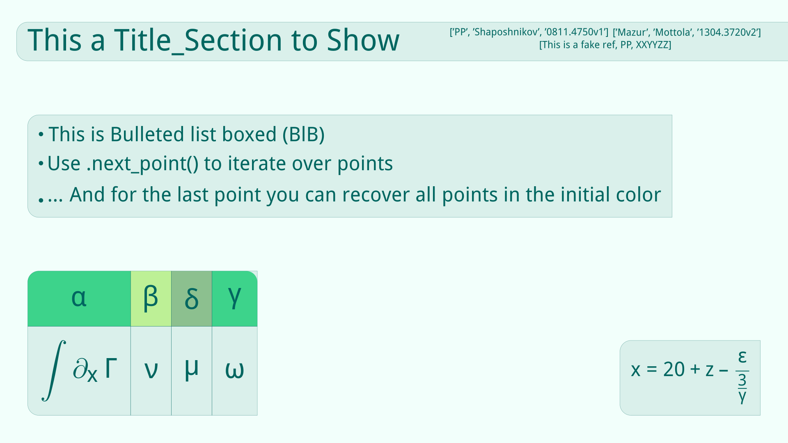
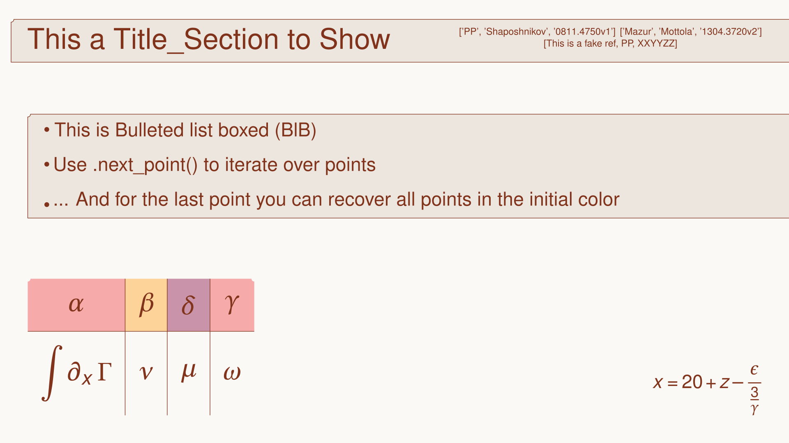
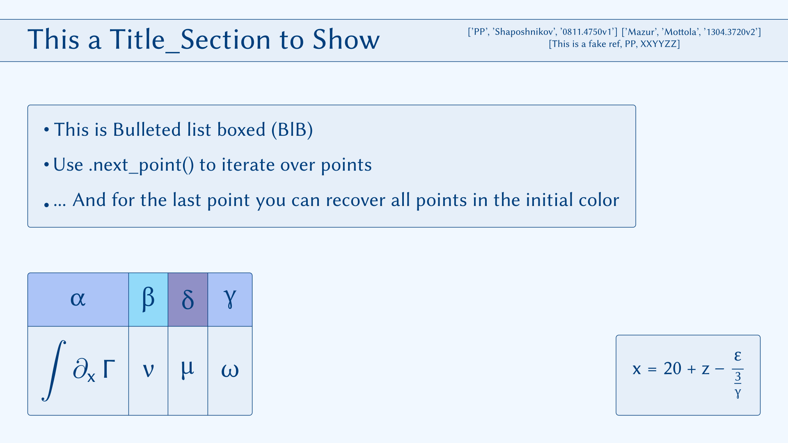

## About Beanim
---------------------------------------------------------------------

- This repository contains v2.0 of beanim (Beamer + Manim) libraries. 
- This package aims to offer a similar experience to that of beamer in latex, by offering familiar properties in Manim + ManimSlides to the slides created by Beamer.
- While the package is currently quite limited, the idea would be to improve and expand by collaboration with other people interested in enhancing the package.

-----------------------------------------------------------------------

[!WARNING]
- The package will be displayed in pip as **manim_beanim**. This is also the way to import the package in the preamble of your python files. However, documentation and webpage will just keep the name as **beanim** for simplicity.

-----------------------------------------------------------------------

## Examples

Here you can find an overview of the current templates and how almost all objects look like in each template (You can find the code in examples/example_generic.py file). 
New templates will be added in the incoming versions.

|  |  |  |  |
|:--------------------:|:--------------------:|:--------------------:|:--------------------:|
| Title Slide default template            | Title Slide fancy_mint template          | Title Slide fire_autumn template            | Title Slide blue_ice template            |

|  |  |  |  |
|:--------------------:|:--------------------:|:--------------------:|:--------------------:|
| Generic Slide default template            | Generic Slide fancy_mint template          | Generic Slide fire_autumn template            | Generic Slide blue_ice template            |


-----------------------------------------------------------------------

## Installation and use

- In order to **install** this library, do the following:

```bash
git clone https://github.com/PanoPepino/beanim

pip install beanim/ .

```

- To **use** with in your manim files, call it with:

```python
from manim_beanim import *
```

-----------------------------------------------------------------------

## TO DO

(Collaboration is welcomed!!)

- Create logo to add to Github and webpage [_]
- Check docstrings for a better documentation experience [_]
- Fix table class [_]
- Add personal research equations and references. Ignore with .git. [_]
- To create Plot_General (Modify so that it behaves like Eq_General, i.e. data_base, dictionary or manual input) [_]
    - Inputs should be axis labels, length and plots. [_]
    - Possible methods: 
        - FadeIn axis [_]
        - Draw plot with iterator [_]
- To create underbar with information like title, author, remaining slides and similar stuff. [_]
- If possible, make the equation number of the paper the key of the dictionary for Equation. [_]
- More templates. Always more templates. Try to simulate most known beamer ones. [_]
- Extra features to Title_Section and similar (underbar, different color for first Capital letter, etc.) [_]
- Extra animation methods (Sliding Title_Section + delayed background, etc..) [_]

