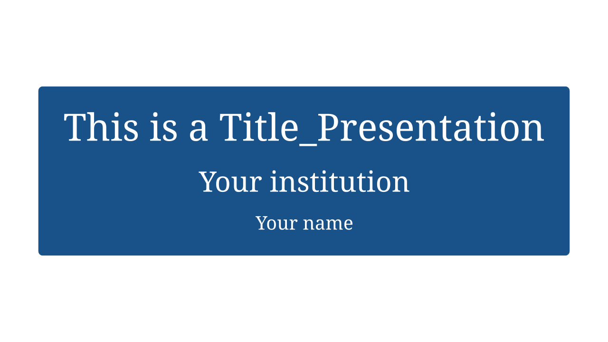
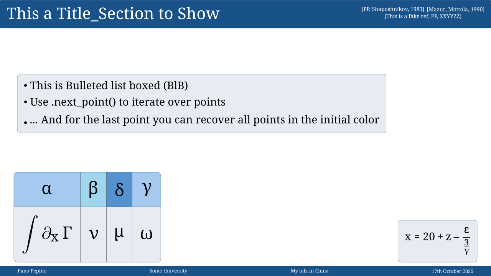

<div align="center">

# Beanim

**Beamer-vibes library for creating beautiful Manim presentation slides**

<a href="https://www.buymeacoffee.com/panopepino" target="_blank">
  
</a>

[Documentation](https://panopepino.github.io/beanim/) • [Examples](#examples) • [Installation](#installation)

</div>


## 📖 About Beanim

This repository contains v2.1 of **beanim** (Beamer + Manim) libraries. This package aims to offer a similar experience to that of Beamer in LaTeX, by offering familiar properties in Manim + ManimSlides to the slides created by Beamer.

While the package is currently quite limited, the idea is to improve and expand through collaboration with other people interested in enhancing the package.

> **⚠️ Important Note**  
> The package will be displayed in pip as **manim_beanim**. This is also the way to import the package in the preamble of your Python files. However, documentation and webpage will keep the name as **beanim** for simplicity.


## 🎥 Example Presentation

Here's a complete presentation created with Beanim demonstrating all the main features:

<div align="center">
  <a href="https://panopepino.github.io/web_page/main_page/presentations/2025_06_jsps/jsps_slide.html" target="_blank">
    
  </a>
</div>


<sub>*Click the button above to view the interactive presentation in a new tab*</sub>


## Examples

Here you can find an overview of the current templates and how almost all objects look like in each template. New templates will be added in the incoming versions.

### Title Slide Templates

<div align="center">
  
  
  
  
  
</div>

<div align="center">
  <sub><b>Default</b> • <b>Fancy Mint</b> • <b>Fire Autumn</b> • <b>Blue Ice</b> • <b>Beamer Like</b></sub>
</div>

### Generic Slide Templates

<div align="center">
  
  
  
  
  
</div>

<div align="center">
  <sub><b>Default</b> • <b>Fancy Mint</b> • <b>Fire Autumn</b> • <b>Blue Ice</b> • <b>Beamer Like</b></sub>
</div>


### Installation

In order to **install** this library, do the following:

```bash
git clone https://github.com/PanoPepino/beanim

pip install beanim/ .
```

- To **use** with in your manim files, call it with:

```python
from manim_beanim import *
```


For detailed usage instructions and API reference, visit the [📚 documentation](https://panopepino.github.io/beanim/).


## Future Features

The following features are planned for future versions:

- 🎨 **Multiple Templates**: More templates.
- 📊 **Plot Support**: Generic plot creation with data input (in development).
- 🔢 **Equation Handling**: Refer to your equations as you do in your LaTeX articles (i.e. \ref{your_label})
- ✨ **Animation Methods**: Sliding titles, delayed backgrounds, and more...
- 🎯 **Beamer-like Experience**: More Beamer like features to come.

## 💖 Support My Work

If you find this project helpful, consider supporting its development. Thank you!

<p align="center">
  <a href="https://www.buymeacoffee.com/panopepino" target="_blank">
    
  </a>
</p>


<!-- ## TO DO

(Collaboration is welcomed!!)

- Add personal research equations and references. Ignore with .git. [_]
- To create Plot_General (Modify so that it behaves like Eq_General, i.e. data_base, dictionary or manual input) [_]
    - Inputs should be axis labels, length and plots. [_]
    - Possible methods: 
        - FadeIn axis [_]
        - Draw plot with iterator [_]
- If possible, make the equation number of the paper the key of the dictionary for Equation. [_]
- More templates. Always more templates. [_]
- Extra features to Title_Section and similar (underbar, different color for first Capital letter, etc.) [_]
- Extra animation methods (Sliding Title_Section + delayed background, etc..) [_]
-->
